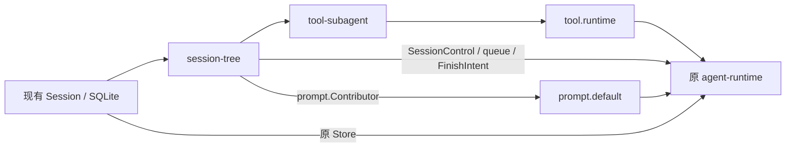

# Ingot Sub-Agent 轻量方案：单 Turn、Session meta 与按需状态

> **历史设计 / Historical design。** 本文从 Core 迁入负责实现的 plugins 仓库。
> 当前配置和行为见 [agent-default](../../agent-default/README.md)、[tool-subagent](../../tool-subagent/README.md)、[session-sqlite](../../session-sqlite/README.md)。
> 公共合同见 [SDK agent/children.go](https://github.com/ingot-agent/sdk/blob/main/agent/children.go)；本文不是发布版本承诺。

> 状态：设计草案 v7；新增能力尚未实现。
> 日期：2026-09-19
> 边界：同进程、同一个 agent.Runtime；不改 ingot-core、Builder、ABI 或 WebUI。
> 数据：直接扩展现有 Session meta，仍保存在原 sessions 表中，不新建 agent meta 表或任务数据库。

## 1. 本版确定的行为

每种子代理的系统提示词、工具集合和可委托类型提前配置。父代理只选择类型，提供任务、
上下文与工作目录；系统创建一个普通持久化 Session 并注入配置。

一个子 Session 只执行一次 Agent Turn。该 Turn 内可以有多轮模型和工具调用，
但结束后不再接受第二条任务。补充工作、失败重试或中断后重新派发，都创建新的 Session。
正常完成、报错、中断和取消都统一收尾；终态保存失败时向本次等待调用返回错误。
后续查询读取已持久化的 Meta，不单独保留未落库的结算故障。
父根据结果决定是否创建新 child；系统不重跑旧任务，少量重试只用于保存状态。

公开管理只有 SessionID，继续使用 c0_、c1_、c2_ 等层级前缀。没有额外执行编号。
父子关系仍保存 parent/root，前缀只表示深度，不代替权限校验。

本版提供：

- spawn_agent：创建并运行，wait=true 等待，wait=false 接纳后返回。
- check_agent：不等待任务完成，读取当前状态及必要诊断。
- wait_agent：等待当前 child 的执行结束并读取系统保存的结果。
- list_agents：按需、分页查看子节点摘要。
- cancel_agent：明确取消指定分支中的活动任务。
- submit_agent_result：子代理提交最终结果，由系统结束本次执行并结算。

删除 send_agent 以及同一 child 的后续任务队列、续聊和执行恢复。
后台任务正常情况下可跨越父 Turn 的正常结束；但用户打断父代理时，整棵目标子树中
除了 completed，其他状态全部变成 interrupted，并停止尚在运行的任务。

worktree 仍由父代理通过已有 shell 工具创建、检查、合并和清理。Runtime 只绑定已有目录。
不新增子进程、Worker Image、部署系统、Git 管理器或 WebUI 子会话展示。
WebUI 的会话列表只展示普通/root Session，子 Session 由父通过子代理工具管理。

## 2. 总体结构与职责

```text
同一个 Runtime
├── Root Session A
│   ├── Child A1：一个 Turn
│   │   └── Child A11：一个 Turn
│   └── Child A2：一个 Turn
└── Root Session B
    └── Child B1：一个 Turn
```

| 部分 | 职责 |
|---|---|
| session-tree Component | 类型校验、创建接纳、树索引、状态缓存、队列、查询与打断 |
| 原 agent-runtime Component | 消费队列，使用同一个实例的 execute，执行局部工具/提示词规则 |
| tool-subagent Plugin | 普通工具入口，包括提交结果工具；不执行另一套 Agent Loop |
| 原 Session/SQLite Plugin | 会话、历史、workspace，以及 sessions.meta 的存取和条件更新 |
| SQLite 中的 Session meta | 亲缘、六态、任务配置和正式结果的持久依据 |
| 内存中的节点与执行对象 | 活动任务控制、有界缓存和本次等待通知；持久状态以 Meta 为准 |

session-tree 不依赖 agent.Runtime 或 tool.Runtime。它把任务放入一个共享待执行队列，
原 Runtime 通过私有 SessionControl 消费队列并启动 goroutine。



只有静态能力依赖，没有 Runtime 回填、动态插件查找或第二个执行器。
存储能力提供者仍只有一份，Session 历史继续走原 Store，文件工具继续走原 workspace Resolver。

## 3. SessionID 与父子身份

新 ID 格式为：

```text
c<depth>_<原随机ID>
```

根为 c0_，直接 child 为 c1_，孙节点为 c2_；同层节点共用前缀，随机后缀保证唯一。
标准 SQLite 实现保留原 16 字节随机值的 32 位十六进制编码。

Store 创建时生成完整 ID。CreateRequest 增加 Depth，默认 0；tree 根据真实父节点
计算 parent.Depth + 1，检查溢出和深度上限。模型不能传 depth、id_prefix 或完整 ID。

已有 ID 继续兼容读取，不自动重写主键。普通旧根按深度 0 处理；亲缘从可信 metadata
判断，不能只凭前缀认定调用者有权访问某个节点。

执行 Scope 保持原样：

```go
type Scope struct {
    SessionID session.ID
}
```

tree 从真实工具 invocation.Scope 取得父 Session，检查它的当前内部执行对象与取消状态。
创建前捕获该对象，完成 IO 后复查同一个对象，防止旧调用误挂到父的下一 Turn。
不把身份放进隐藏 context.Value，也不支持保存旧 Scope 后脱离原取消链重放。

亲缘关系由系统计算并保存：ParentSessionID、RootSessionID、Depth 创建后不变。
父节点同时在 meta.agent.child_session_ids 保存直接子 Session ID，供直接导航和批量查询；
不保存全部后代 ID。该字段是系统维护的冗余关系索引，亲缘校验仍以 child 的 parent/root 为准。
根和子节点都可拥有后代；所有管理调用必须校验亲缘和类型授权，ID 不是授权凭据。

## 4. 六个业务状态

状态值统一写作 working，不使用 woking。

| 状态 | 中文 | 含义 |
|---|---|---|
| queued | 队列中 | 已持久接纳，尚未开始 Agent Turn |
| working | 执行中 | 该 Session 唯一的一次 Turn 已开始 |
| interrupted | 被打断 | 用户打断父分支、进程中断或关闭等使任务失效，不能继续 |
| canceled | 被取消 | 父通过 cancel_agent 明确取消了活动任务 |
| failed | 失败 | 模型/工具错误、超时、缺少结果提交或结果处理失败 |
| completed | 完成 | 结果提交有效，执行已退出，最终结果与状态已原子保存 |

普通转移：

```text
创建成功 → queued → working → completed
                    ├─────→ failed
queued / working ──────────→ canceled
queued / working ──────────→ interrupted
```

用户打断父代理有明确的覆盖规则：

```text
目标子树：
completed                         → 保留 completed 和结果
queued / working / failed /
canceled / interrupted             → interrupted
```

failed/canceled 的原错误、Outcome 和 previous_state 保留，不因为管理状态改为 interrupted
就丢失事实。completed 是唯一在父打断时保留的状态。

任一终态都不能回到 queued/working。不存在重启旧 Session、第二次 Turn 或同 ID 重试；
需要再做任务，由父重新 spawn 新 Session。

### 4.1 状态与实际停止分开

业务状态只有上述六个，不增加 stopping/draining 作为第七、第八种业务状态。
实际是否已退出另记 execution_stopped：

- true：这一执行及其必要收尾已确认停止；queued 且从未启动也可为 true。
- false：执行仍在运行或正在响应取消。
- null：异常退出后无法确认外部工具是否遗留 writer。

状态被改为 interrupted/canceled 后，底层调用可能还在退出。不能仅看状态就删除目录、
释放所有活动名额或启动会访问同一目录的新任务。

completed 必须满足 execution_stopped=true。一个 completed 节点仍可能有未完成孙任务；
检查整分支时要继续检查后代，不能在 completed 节点处停止遍历。

终态保存失败是存储诊断，不增加第七种业务状态。本次等待无法确认持久终态时，响应使用
state=null、state_confirmed=false，并报告该执行对象已知的退出事实；详见第 10.1、12 节。
持久化 meta.agent.state 仍只允许上述六态，不能用内存候选结果宣布 completed。

## 5. 内存状态表：map 加稀疏树索引

无需把数据库中所有历史会话构造成完整内存树。使用有界 map 和一个共享队列：

```go
type NodeSummary struct {
    SessionID        session.ID
    ParentSessionID  session.ID
    RootSessionID    session.ID
    Depth            uint32
    AgentType        string
    State            State
    ExecutionStopped *bool
    HasResult        bool
    ErrorSummary     string
}

type RuntimeTree struct {
    mu sync.Mutex

    nodes    map[session.ID]*NodeSummary   // 活动节点与按需读取的有界缓存
    children map[session.ID]*ChildrenPage // 只保存已读取的子节点页

    active   map[session.ID]*Execution    // 排队、执行和收尾期间的控制对象
    ready    []session.ID                 // 一个 Runtime 一个待执行队列
}
```

Execution 保存 ctx/cancel/done、候选提交结果、调用关联和本次返回的结果或错误，不公开新的 ID。
每个 child 至多创建一个 Execution，终态 Session 不会再分配新的执行对象。

规则：

- SessionID 点查通过 map 快速定位；Parent/Root 和已加载 children 构成树索引。
  持久化的 child_session_ids 按需使用，不要求完整复制到内存摘要或 children 缓存。
- children 中没有某个节点不代表数据库中不存在，空缓存不能当作完整子树。
- 活动任务及必要祖先固定在内存，直到实际停止；历史终态摘要可以 LRU/TTL 淘汰。
- 提示词快照、完整任务和结果正文不随所有摘要进入缓存，执行或明确取结果时才读取。
- 队列及活动任务数有上限；满时拒绝接纳，不无限积压。
- 锁只保护短时状态操作，不持有全局锁等待模型、工具或任务完成。
- 同一根的创建、最终结算、子树打断有短的 mutation gate，协调数据库事务和内存发布；
  不在整个 Agent Turn 中占着这个 gate。

SQLite meta 是持久状态依据，map 是运行控制与缓存。数据库发生状态更新后更新或失效相关
缓存；check_agent 的状态查询不能仅相信可能过期的历史缓存。
收尾完成后从 active 移除执行对象；已取得该对象引用的等待者仍可读取本次结果或错误。
不为结算失败额外保留对象或写入另一份诊断缓存，后来的查询以数据库最后保存的内容为准。

## 6. 直接扩展现有 Session meta

### 6.1 数据位置与结构

在现有 session.Metadata 上增加 Meta 数据，在原 sessions 表增加一个 JSON meta 列。
不新建 agent meta 表、独立任务库，也不靠扫描 entries 恢复状态。

基础 ID、Title、CreatedAt、UpdatedAt、ArchivedAt 保留原语义。agent-default 使用
meta.agent 命名空间，其他命名空间由其 owner 管理。

示意内容：

```json
{
  "agent": {
    "schema_version": 1,
    "kind": "subagent",
    "parent_session_id": "c0_0123456789abcdef0123456789abcdef",
    "root_session_id": "c0_0123456789abcdef0123456789abcdef",
    "child_session_ids": [],
    "depth": 1,
    "agent_type": "reviewer",
    "definition_digest": "definition-digest",
    "definition": {
      "system_prompt": "你是审查代理。完成后调用 submit_agent_result。",
      "tools": ["read_file", "search", "submit_agent_result"],
      "allowed_child_types": []
    },
    "task": "检查路径处理逻辑",
    "context": "",
    "ready": true,
    "state": "queued",
    "result": null,
    "error": null,
    "outcome": null,
    "previous_state": null,
    "interrupt_reason": null,
    "execution_stopped": true,
    "started_at": null,
    "finished_at": null,
    "updated_at": "2026-09-19T08:00:00Z"
  }
}
```

每个新 child 都初始化 child_session_ids=[]；它继续派发任务时，系统向该数组追加新 ID。
父 root 首次创建 child 后可以仅有下面的 agent Meta，不因此成为 subagent 或获得子任务状态：

```json
{
  "agent": {
    "child_session_ids": ["c1_fedcba9876543210fedcba9876543210"]
  }
}
```

数组只存直接 child 的唯一 ID，不复制其状态、结果或任务配置。字段缺失表示关系索引尚未
初始化，需要按 parent 索引查询；空数组才表示没有直接 child。旧父首次追加前先在同一事务
中补齐已有直接 child，避免把缺失字段直接当成空数组。归档、完成、失败和中断均保留关系。

元数据中只保存必要事实和类型快照。最终 result 为有大小上限的文本结果，首次提交以前为
null；只有 completed 才能作为正式结果返回。失败诊断和原始 Outcome 不伪装成提交结果。

meta.agent.updated_at 用于任务状态变化，不偷换现有 sessions.updated_at 的“最后消息
Entry 提交时间”语义。已有会话的 meta 缺省为空对象，保留普通 root 行为。

### 6.2 创建与读写能力

在现有 Session 元数据存取能力上补齐：

| 操作 | 用途 |
|---|---|
| 创建时提供初始 Meta | 会话行与 child 身份/queued 状态在同一事务中保存 |
| 原子创建 child 并登记父关系 | 创建 child 行，同时向父的 child_session_ids 去重追加 ID；全部提交或全部回滚 |
| 按 SessionID 读取 Meta/摘要 | check、权限和角色判定 |
| 按一组 SessionID 批量读取 Meta 摘要 | 一次查询取得所需 child 摘要，禁止逐 ID 点查形成 N+1 |
| 按 parent/root/state 分页查询 Meta 摘要 | list 与按需恢复树索引 |
| 删除 child 时维护父关系 | 物理删除与移除父的 child_session_ids 中对应 ID 在同一事务提交 |
| 条件更新 meta.agent | queued→working、失败/取消、正式结果发布、退出事实 |
| 在事务中更新子树 Meta | 用户打断时修改全部非 completed 后代 |
| 恢复旧未结算状态 | 将旧 queued/working 标为 interrupted，不重跑 |

SDK 可用一个可选的窄 MetaAccess 能力承载这些存取操作，读写的仍是原 sessions.meta，
不是另一套 Agent 存储系统。无子类型配置的原 root 组合不能被迫提供新能力；启用子代理
却缺少相应 Meta 能力时明确报不支持。

CreateRequest 增加初始 Meta，并保留层级 Depth；原 root 调用不传 Meta 时使用空对象。
child 创建通过同一 SQLite 提供者的原子创建/登记能力，同时写入自身 Meta 与父的 ID 数组，
不能先独立 Store.Create 再另开事务更新父。这消除“Session 已创建，但身份或父关系尚未保存”
的窗口。父更新只修改关系字段，不覆盖其状态/结果，也不改变 sessions.updated_at 的消息时间。
workspace 仍用原 Manager.Assign；
初始化期间 ready=false，全部成功后才变 true 并入队，半初始化会话不会执行。

所有更新只修改自己的 namespace，必须保留 meta 中其他插件的数据。条件更新在数据库
事务内执行；若使用整份 Meta 的 CAS，只能对明确版本/旧值冲突重读并重新验证条件。
不要读出整份 JSON 后无条件覆盖它，也不把其他 namespace 的变化当成执行失效。

单 Turn 不需要额外 attempt ID 或执行版本。完成的业务条件是：
该 child 仍为 working、没有正式结果、此次提交已由 Runtime 确认；状态一旦被打断，
就不会再回到 working，因此迟到完成不能通过条件更新。

### 6.3 查询效率与迁移

SQLite 在现有 sessions 表上增加 meta 列和必要的 JSON 表达式索引：

```sql
ALTER TABLE sessions
ADD COLUMN meta TEXT NOT NULL DEFAULT '{}';

CREATE INDEX sessions_agent_parent
ON sessions (
  json_extract(meta, '$.agent.parent_session_id'),
  created_at,
  id
);

CREATE INDEX sessions_agent_root_state
ON sessions (
  json_extract(meta, '$.agent.root_session_id'),
  json_extract(meta, '$.agent.state')
);

CREATE INDEX sessions_agent_state
ON sessions (json_extract(meta, '$.agent.state'));
```

写入时严格校验 Meta 为合法 JSON 对象和 agent 字段类型。列表只投影需要的摘要，
按 (created_at, id) 做游标分页，限制单页数量，不把所有 Prompt/结果随列表载入。

仅需直接子 ID 时读取父的 child_session_ids；同时查询多个父节点关系时，在一次批量 Meta
查询中投影该字段，不对每个父节点再反查 children。需要 child 状态时，在数据库内展开
数组并 JOIN sessions，或对一页 ID 做一次批量摘要查询，不能取到 ID 后循环调用点查接口。

例如直接子摘要的一页可由一条 SQL 返回（此处省略权限校验，参数已由系统验证）：

```sql
SELECT child.id, child.created_at,
       json_extract(child.meta, '$.agent.state') AS state,
       json_extract(child.meta, '$.agent.execution_stopped') AS execution_stopped
FROM sessions AS parent
JOIN json_each(parent.meta, '$.agent.child_session_ids') AS ref
JOIN sessions AS child ON child.id = ref.value
WHERE parent.id = :parent_id
  AND json_extract(child.meta, '$.agent.parent_session_id') = parent.id
  AND (:cursor_created_at IS NULL
       OR (child.created_at, child.id) > (:cursor_created_at, :cursor_id))
ORDER BY child.created_at, child.id
LIMIT :page_size;
```

数组会随历史直接 child 增长，分页在数据库内完成，不为每页把完整 ID 数组加载进 Go。
保留已有 parent 表达式索引：大量 children 的分页可直接走该索引；这同样一次返回摘要，
没有 N+1。旧 Meta 缺少 child_session_ids 时也按该索引分页读取，按需在事务内回填关系，
不扫描 Entries，也不在启动时加载全部会话。数组存在不代表已加载所有内存 children。

保持原 Query.List 的轻量基本信息用途，本方案将其默认发现范围明确为普通/root Session
（含归档）；Session/SQLite 查询提供者在数据库内排除 child，WebUI 沿用原列表接口。
旧普通根继续兼容，root 拥有 meta.agent.child_session_ids 不会使它被当成 child 排除。
包含 child 的查询由显式 MetaAccess/List 能力提供；不让 WebUI 原列表因为 Metadata 扩展
就返回子任务、完整配置和结果。WebUI 不增加 Meta 解析或子会话展示逻辑。

这次确实需要扩展 SDK Session 的 metadata 与 SQLite schema，但只在现有会话结构中
增加字段和操作；原消息表、workspace 表与 Agent 历史格式继续复用。

## 7. 懒加载恢复，不读取会话历史

Runtime 启动时不执行“列出所有 Session→逐个读取 Entries→构造整棵树”。

恢复过程分为两件事：

1. 在开始接纳新任务前，利用状态索引在数据库内将旧 queued/working 标记 interrupted，
   原因 runtime_restart。这个集合更新不把记录加载进 Go，也不构造内存树。
2. nodes/children 缓存保持空或仅含新活动任务，等父实际查询时按需填充。

这一恢复只在正常运行模式、持有现有 Runtime Home 独占写锁时执行。check 模式不启动
任务恢复。数据库由同一 Runtime Home 管理，不支持多个进程同时接管同一会话任务。

check_agent(session_id) 的流程：

```text
校验调用者与目标归属
  → 按 ID 查询 sessions.meta
  → 查询成功后更新有界节点缓存，失败则直接返回查询诊断
  → 立即返回状态
```

权限校验可使用当前执行保留的可信亲缘，必要时查询少量祖先 Meta；数据库不可用且亲缘
无法验证时，返回查询错误，不跳过授权。

它不调用 agent.History.Load 或 Store.Load 来重放消息，也不等待 done。
“立即”表示不等子任务完成，数据库 IO 仍有正常超时和错误处理。

list_agents 默认分页查直接 child；需要下一层时再查询那个节点的 children。
通过 child_session_ids 在数据库内关联查询或按 parent 索引一次取得当前页摘要，
不对每个 child 再读取一次 Meta。不把整棵树递归展开，不要求缓存齐全；并发查询同一个
节点可以合并，避免重复加载。child 创建或物理删除后更新或失效父的关系缓存。
数据库分页查询失败时明确返回查询错误，不把局部缓存当作完整列表。

completed 直接从 meta 读取正式结果。旧 queued/working 只恢复为 interrupted，不恢复
goroutine、队列或执行资格；父需要继续工作时重新创建 Session。

queued 从未启动，可确认 execution_stopped=true；旧 working 的进程内执行已消失，
但可能遗留外部 shell writer，不能确认时保持 execution_stopped=null。
查到“被打断”不等于可以马上复用或删除原工作目录。

退出事实还需独立校准：进程也可能在 state 已是 interrupted/canceled/failed、但
execution_stopped=false 时退出。启动时将这些遗留的 false 改为 null（不能确认外部
writer 时），不为了校准退出事实改写其业务状态。completed/true 保持不变；这一更新
同样在数据库内完成，不加载全树或读取 Entries。

## 8. 类型配置与最小工具面

类型配置仍位于：

```text
<runtime-home>/state/agent.default/subagents.toml
```

示例：

```toml
subagents_config_version = 1
root_allowed_types = ["coder", "reviewer"]

[[agents]]
name = "coder"
description = "实现一项代码任务并提交结果"
system_prompt = """
你只执行本次分配的一个 Agent Turn；其中可以有多轮模型和工具调用。
完成任务后必须调用 submit_agent_result 提交最终结果。
提交结果的那一轮只调用这一个工具，提交后本次任务结束。
若信息不足，将缺失信息和已完成部分写入提交报告，不等待后续消息。
"""
tools = [
  "read_file", "search", "edit_file", "shell_exec",
  "list_agent_types", "spawn_agent", "check_agent", "wait_agent",
  "list_agents", "cancel_agent", "submit_agent_result"
]
allowed_child_types = ["reviewer"]

[[agents]]
name = "reviewer"
description = "检查代码并提交审查结论"
system_prompt = """
只审查本次任务范围。你只有一个 Agent Turn，不接收后续追加任务。
完成后调用 submit_agent_result，明确列出问题或说明未发现问题。
该提交必须是所在模型轮唯一的工具调用。
"""
tools = ["read_file", "search", "submit_agent_result"]
allowed_child_types = []
```

系统校验所有类型存在、工具已装配、委托引用合法，并要求每个子类型启用提交结果工具。
配置文件的 tools 是子类型工具名单的唯一来源；系统将同一份冻结配置用于模型可见工具
和实际工具分发校验。模型提出调用请求后，必须确认工具在当前名单中才能执行；不在名单中
的工具即使已被全局 Runtime 注册，也不能分发。不另外维护一份独立的权限名单。
root 的工具视图排除 submit_agent_result，直接调用提交能力也必须拒绝 root。
公共 system 底座继续保留，子类型提示词由系统按 Session 注入；父的任务只进入 user 输入。

| Tool | 作用 |
|---|---|
| list_agent_types | 返回调用者可委托的预配置类型 |
| spawn_agent | 选择类型并创建单 Turn 子任务，支持 wait |
| check_agent | 立即返回 Meta 记录的状态、错误和退出情况；可选读取 completed 结果 |
| wait_agent | 有执行对象时等待实际退出及有界结算，返回 Meta 或本次结算错误；无执行对象时直接查 Meta |
| list_agents | 分页查看直接 children 或指定有权访问节点的 children |
| cancel_agent | 取消指定分支的 queued/working，报告实际是否已停止 |
| submit_agent_result | child 提交最终文本结果，触发系统结束执行 |

check_agent 可以让父在工作步骤之间早发现失败或中断，但不会抢占父正在执行的长 shell
命令或模型请求，也不会自动唤醒父模型。父需要主动调用；本版不加后台轮询通知系统。

API 形状示意：

```go
type ChildRequest struct {
    AgentType string
    Task      string
    Context   string
    Workspace *workspace.Binding
    Wait      bool
}

type Children interface {
    Types(context.Context, execution.Scope) ([]AgentTypeInfo, error)
    CreateChild(context.Context, execution.Scope, ChildRequest) (ChildSnapshot, error)
    Check(context.Context, execution.Scope, session.ID, bool) (ChildSnapshot, error)
    Wait(context.Context, execution.Scope, session.ID) (ChildSnapshot, error)
    List(context.Context, execution.Scope, ChildrenPageRequest) (ChildrenPage, error)
    Cancel(context.Context, execution.Scope, session.ID) (CancelResult, error)
    SubmitResult(context.Context, execution.Scope, string, string) error
}
```

SubmitResult 的两个 string 分别为真实 ToolCallID 和结果文本，由工具实现从 invocation
取出调用关联；模型只能填写 result，不能指定提交给哪个 Session、parent 或结果状态。

父侧工具把 child 的 failed/interrupted/canceled、配额拒绝、等待超时和已识别的状态
保存/查询故障作为结构化业务结果返回，包含 SessionID（已创建时）、状态确认情况及诊断。
这类业务结果不使用会直接终止父 Turn 的 Go error；父可据此继续查询或创建新 child。
父调用自身的 context 被取消时仍正常传播取消，不把真实用户中断转成普通业务成功。

## 9. 创建、排队与实际执行

共享队列仍只有一个，条目为 SessionID。单个 child 不再有“当前任务/最近任务”的切换：
它从创建到终态只有一项任务。

创建流程：

1. 校验真实父执行、类型授权、目录、深度和配额，预留队列/执行容量。
2. 系统组装初始 meta.agent，通过同一存储事务创建 Session 与 Meta（queued、ready=false、
   child_session_ids=[]），并向父的 child_session_ids 去重追加新 ID；在 mutation gate 内
   复查父执行并协调该事务与分支打断，事务失败不留下单边关系。
3. 通过原 workspace.Manager 绑定已有目录；ready 条件更新成功后准备发布。
4. 在该 root 的 mutation gate 内复查父仍可接纳，发布内存节点、唯一执行控制对象与队列条目。
5. wait=false 返回 SessionID；wait=true 使用创建过程中持有的执行对象引用等待完成通知。

创建事务提交后的 workspace 等初始化失败写 failed 及错误，保留父的子 ID 和可检查元数据，
不启动 Agent；写入失败也进入统一收尾并直接报错。并发创建必须在事务内追加或 CAS
冲突后重读，不能相互覆盖已有子 ID。
父在初始化期间被打断，则最终发布必须失败并保留 interrupted，不能留下可执行的漏网任务。
队列名额不足先拒绝接纳，不无限等待或无限创建会话。

dispatcher 取出 SessionID 后，以条件更新将 queued/ready 变为 working，并标记
execution_stopped=false；条件不匹配时跳过。存储错误不能当成普通条件不匹配：禁止进入
Agent Loop，按统一收尾处理并报错；已有等待者获得本次诊断。只有明确更新成功后才能执行。
同一个 child 不能被两个执行者启动，也不能从任一终态再次启动。

Runtime 使用原模型、工具、Prompt、Store 和 Compactor：
root 与 child 的历史都保留在原 Session 中。每次执行的工具视图和类型配置冻结在局部
frame，并在工具分发前按同一配置校验；不能修改共享 r.tools 或 Renderer 的全局状态。

### 9.1 可选等待

工具层 wait 默认 true；false 只改变返回时机，不改变权限和任务内容。
任务 context 来自 Runtime 生命周期并附带有限 deadline，父正常结束不误取消后台 child。

父在后续 Turn 可以通过 SessionID Check/Wait 之前的任务，但不能再向该 Session 发任务。
用户要继续时使用新的 spawn；是否复用已有 worktree 由父在确认没有旧 writer 后决定。

等待期间父调用被取消会停止等待；如果是用户实际打断父执行，另外触发第 11 节的整棵
子树打断。wait_timeout 本身不等于用户打断父，不取消目标。

## 10. 结果必须通过工具提交，Loop 强制执行

调用示例：

```json
{
  "result": "已检查路径处理。发现一个符号链接边界问题，位置和建议如下……"
}
```

提交过程明确分成“接收候选结果”和“正式完成”：

1. submit_agent_result 校验真实 child Scope、当前状态 working、参数与结果大小。
2. tree 把候选结果和真实 ToolCallID 放入当前执行对象，形成结构化 FinishIntent。
   此时状态仍为 working，不发布 completed，也不关闭 done。
3. 工具通过原 tool.Runtime 的校验/拦截链正常返回；Agent 把这次 Tool Result 写入原历史。
4. Runtime 在工具执行边界核对 FinishIntent 与调用一致，停止后续模型轮，正常返回执行结果。
5. 实际 execute 及必要收尾结束后，统一结算器在 SQLite 事务中复查仍为 working，
   原子写入 meta.agent.result、Outcome、execution_stopped=true，并变为 completed。
6. 保存成功后发布正式结果；保存失败按第 10.1 节直接报错。两条路径在实际执行和有界
   收尾结束后都释放执行名额并关闭 done；已持有执行对象的等待者取得本次返回值，
   后续 Check/Wait 读取 Meta。

同一轮出现提交工具和其他 Tool Calls 时，在任何工具分发之前拒绝该轮，记为
invalid_submission_round；不先执行一部分再猜哪些可以跳过。提交工具必须是该轮唯一调用。

当前 Agent 在最后允许轮遇到工具调用会报 MaxRounds，需要为 child 的提交结束路径适配：
最后一轮仅向模型提供提交工具，并允许合法的单个提交调用。其他实质工具不在该轮执行。
实际分发同样强制只允许提交工具，不只修改模型收到的工具列表。

普通无工具的最终文本不能使 child completed。没有有效提交就自然结束，按
missing_submission 失败；耗尽轮数或超时同样失败，不无限追加“请提交”的提醒。
父 root 仍保留原来正常文本结束的行为。

FinishIntent 不是普通错误或 context cancellation，不用“返回错误再吞掉”伪装成功。
只有工具成功、对应历史写入成功且结束边界被 Runtime 确认的候选才可最终提交。
提交后发生持久化错误、panic 或其他执行失败，不能凭候选结果冒充 completed。

正式完成以数据库事务为准：如果父打断已先把状态改为 interrupted，晚到的完成提交必须
拒绝；如果 completed 已先提交，父打断按规则保留它。结果保存失败返回结构化诊断，不自动重跑。

completed 表示本次执行已提交了有效报告，不表示报告中的代码一定没有问题。
例如 reviewer 报告发现 bug，也可以正常 completed。

### 10.1 所有退出路径统一收尾，状态保存失败也结束等待

每个 child 只获得一次执行机会。正常完成、模型/工具报错、超时、panic、取消、中断，
以及已创建 child 的初始化/启动失败，都进入同一个结算入口；不重新调用 execute。

收尾规则：

1. 先确认实际执行及必要副作用收尾已经退出，保留本次 Outcome、错误、候选结果和退出事实。
   从未开始执行的 child 可确认 execution_stopped=true；取消尚未完成时不能提前确认。
2. 使用独立且有总超时的收尾 context，例如在 context.WithoutCancel(taskCtx) 上设置
   有限 timeout，避免任务已经取消导致终态无法保存。收尾总时限受 Runtime 关闭预算约束。
3. 在该 root 的短 mutation gate 与数据库条件更新下保存状态。短暂存储故障允许少量有界
   重试，每次都重新验证内存中的取消资格和数据库状态；不持有 gate 等待退避，也不重试
   模型、工具或整个任务。
   已 canceled/interrupted 的节点只能补退出事实和诊断，不能被迟到结算改回 completed。
4. 写入返回错误且提交结果不明时，先按 SessionID 读回核对。若确认预期结果与 completed
   已原子提交，则按成功处理；若尚未提交，可在剩余预算内重试条件写入。无法确认时保留
   不确定性，不盲目写 failed 覆盖可能已经提交的 completed。
5. 创建阶段尚无 Execution 时，结果或结算错误直接返回创建调用。有 Execution 时先写入
   它的本次返回值。实际执行和有界收尾都结束后，无论保存
   是否成功，都恰好关闭一次 done、移除 active 中的对象并释放执行名额。等待者在锁内
   取得对象引用后再等待，已持有引用的调用可以取得本次结果；后来找不到对象的调用只查 Meta。

done 表示这次执行与有界结算尝试已结束，不承诺数据库已保存终态。未确认持久化的结果
不能作为正式结果返回。异步执行没有等待者时，结算错误只写现有运行日志；不另设错误
缓存，也不保证后续工具查询能重现这次未落库的诊断。

重试预算耗尽即结束本次结算。后续查询只读 Meta，不恢复写入重试，也不保留待修复任务。
因此终态保存失败后，数据库可能仍是 queued/working；它是最后持久状态，不证明任务
仍在运行。重启时按第 7 节把这类遗留状态改为 interrupted，不恢复旧执行。

普通任务失败后父可创建新 child；若数据库仍不可用，新 Session 的接纳也可能失败，
父应收到存储故障而不是不断创建未持久接纳的任务。父是否重新派发，仍由父自行决定。

## 11. 用户打断父代理：整棵子树统一中断

用户打断的范围按 Session 树决定，不再只看“父这一轮创建的任务”：
该父下面以前派发的后台任务、孙节点和未加载到内存的节点都在范围内。

处理顺序：

1. 原子关闭该分支的管理/执行接纳，阻止新的 child、模型/工具推进和结果完成提交。
2. 与创建/结算协调，在 SQLite 内递归确定所有后代；遍历不能跳过 completed 中间节点。
3. 将后代中全部非 completed 的 meta.agent.state 改为 interrupted，记录原因与原状态，
   清除任何未正式发布的候选资格，保留原错误和 Outcome。
4. 通知内存中的相关活动执行取消；更新或失效缓存。数据库中未加载的节点也已被处理。
5. 等待实际调用退出；迟到回调只补 execution_stopped/诊断，不能改回 failed/completed。
6. 持久化成功后父 Check 得到 interrupted；保存失败由本次取消/等待调用报错，
   后续查询只返回已持久化的状态。父检查现场后决定是否重新 spawn 新 Session。

以上数据库步骤失败时也要保留内存中的分支封禁并尽力取消活动执行，不能跳过实际取消。
统一收尾使用独立 context 尝试记录退出事实；保存失败进入第 10.1 节的诊断路径，不能
声称未加载的所有后代都已可靠更新为 interrupted。

中断更新只修改 meta.agent，保留其他 metadata。SQLite 的递归查询和集合更新在数据库中
完成，不把整棵树加载进 Go。递归仍按 child 的 parent_session_id 关系查找，避免旧父缺少
child_session_ids 时漏掉后代；状态更新必须保留子 ID 数组。初期可以使用 JSON 字段的
索引与递归 CTE，不另建关系表。

创建发布、working 开始和 completed 提交必须参与同一状态仲裁。若创建先完成，它会被
打断事务包含；若打断先发生，旧调用不能随后发布新任务。实现可用每 root 的短 mutation
gate 加数据库条件更新，不在模型或工具执行期间占着 gate。

这里的“用户打断”来自父执行自身的真实取消。父普通文本结束、局部资源回收、工具自己的
等待超时或返回一个 context.Canceled 错误，不得误触发整树打断。
Runtime shutdown 将尚未完结的 queued/working 中断；它不需要改写所有历史失败状态。

cancel_agent 是另一种明确操作：对目标分支的 queued/working 改为 canceled 并停止执行；
completed 保留，其他终态不重新启动。之后若发生用户打断父，canceled/failed 仍按用户
要求统一变 interrupted。

Go 无法强制立即杀掉任意 goroutine。系统会关闭入口并取消实际执行，但只有真正退出才
能标记 execution_stopped=true、释放活动名额或允许清理目录。数据库写入失败也必须明确
报告；不能一边保存失败一边声称所有状态都已可靠变更。

重新派发是父的显式新任务，不等于保证旧副作用不存在。复用原目录前，父需确认旧 writer
已退出并检查已有修改，不能因为状态叫 interrupted 就从头盲目重复所有动作。

## 12. Check、Wait 与缓存一致性

check_agent 不等 done，直接读取当前 Meta；读取失败时返回查询诊断。正常返回示例：

```json
{
  "session_id": "c1_fedcba9876543210fedcba9876543210",
  "state": "interrupted",
  "state_confirmed": true,
  "execution_stopped": false,
  "has_result": false,
  "reason": "parent_user_interrupt"
}
```

include_result=true 且状态 completed 时读取正式结果。失败或中断返回诊断，不把模型最后
一段文本或历史中的候选提交当成最终结果。

spawn_agent(wait=true) 或已取得 Execution 引用的 wait_agent，在本次执行退出但终态
写入失败且无法确认数据库最终值时，直接返回例如：

```json
{
  "session_id": "c1_fedcba9876543210fedcba9876543210",
  "state": null,
  "state_confirmed": false,
  "execution_stopped": true,
  "reason": "state_persistence_failed",
  "error": {
    "message": "子代理执行已结束，但最终状态保存失败；未确认正式结果。"
  }
}
```

state_confirmed 表示返回的状态是否有持久依据，不保证它反映此刻的实际执行情况；false 时
state 为 null，不伪造 failed/completed，也不新增业务状态。此时不返回正式 result 或断言 has_result=false，
因为提交是否成功可能尚不确定。退出事实来自本进程执行对象，和终态是否已落库分别表达。
普通 Meta 查询失败且无可信退出记录时，也返回结构化查询诊断，execution_stopped=null。
上述字段属于工具响应，不能反写 null 到持久化 meta.agent.state。

wait_agent 在有执行对象时等待实际退出及有界结算结束；本次结算失败就直接返回该错误，
结算成功后重读 Meta。不把 done 当成状态已落库或永远不变的保证。已有 failed/canceled
后来被父打断且更新成功，新的 Check/Wait 返回 interrupted，原失败事实仍在诊断中。
过去返回的快照不会追溯修改。

没有本进程执行对象时，wait_agent 只查询一次 Meta 后立即返回，并说明没有可等待的本进程
执行；即使 Meta 仍为 queued/working，也不创建新的 done 或按该状态无限轮询。正在排队的
已接纳任务使用其原有执行控制对象等待。历史查询不能还原未保存的结算错误或正式报告。
恢复后的未知 writer 通过 execution_stopped=null 表达，不能等待重启前已经不存在的 done。

Wait 只对应目标自身的一次 Turn。目标即使 completed，也可能有独立后台孙任务；
目录清理需检查整个分支是否退出。完成/失败记录写入有界超时，不能让等待者永久挂起；
存储失败作为父可处理的业务诊断返回，不能只把成功结果留在内存就宣布 completed。
spawn_agent(wait=true) 与 wait_agent 使用相同规则。父看到 failed/interrupted/canceled
或存储诊断后自行决定后续动作；任何检查、等待或状态保存重试都不会再次执行旧 child。

## 13. 取消、并发、worktree 与现有 UI

异步仍是 Runtime 内 goroutine 执行，不为 child 新开进程或编译二进制。
并发限制放在模型调用等真实资源边界，父等待不占完整 Agent 执行槽，避免嵌套等待死锁。

运行中的节点及实际未退出的中断节点占用活动配额；SQLite 中的历史终态记录不永久占用
执行名额。队列满或配额不足直接拒绝。模型异常只使相关任务 failed，不无故中断其他根。

worker 普通 panic 在 child 边界记录并失败结算，任意原生崩溃/OOM 仍属于同进程风险。
进程重启只恢复元数据状态，不恢复旧执行或自动提交候选结果。

worktree 由父通过 shell 管理，创建 child 时传入已有目录。系统复用原 WorkspaceManager
与 Resolver，不增加自动 Git 创建、合并、回滚或删除。父子持久历史与代码目录生命周期分开。

WebUI 不修改，不新增树展示、子任务卡片、自动唤醒父模型、自动刷新或删除协调。
WebUI 的会话列表只展示普通/root Session，不展示 child；过滤由第 6.3 节的 Session
查询提供者完成。子任务状态/结果由父通过 check_agent、wait_agent、list_agents 获取。

普通缺失信息由 child 用提交报告说明；父收到后自己处理并创建新任务，不给旧 child 续聊。
系统配置的已有交互/审批仍沿原宿主能力工作，不因 child 或 wait=false 自动批准。
有界 deadline 防止无宿主或无人回答的请求无限等待，不新增子会话交互路由。

普通 Fork 继续复制既有消息和 workspace，但新的 Meta 不自动继承执行状态/结果。
本版默认新 Fork 的业务 Meta 为空，尤其不能复制 meta.agent 造成另一份可执行 child。
child_session_ids 也不复制，新 Fork 不加入原父的子 ID 数组。
Fork child 也不是重新派发；Agent 的根入口对非根层级且没有有效 child Meta 的会话拒绝
执行，父应通过正常 spawn 创建任务。

外部入口在任务运行时归档/删除 Session 不代表任务已经停止。先 Cancel 并确认物理退出；
若仍发生外部删除，按原 Store 错误报告，不承诺副作用回滚或新增 WebUI 保护。
正常物理删除 child 时，同一存储事务移除父数组中的对应 ID 并失效关系缓存；归档不移除。
存在后代的节点不可单独物理删除，应在确认分支退出后整体删除，避免破坏剩余节点的亲缘链。
这些关系维护在存储层完成，不要求 WebUI 解析 Meta。

## 14. 实现范围与验收

| 模块 | 修改范围 |
|---|---|
| Core / Builder / ABI / WebUI | 不改 |
| sdk/agent | Children 的 Create/Check/Wait/List/Cancel/SubmitResult，单 Turn、六态及状态确认/存储诊断响应 |
| sdk/session | Meta 数据、原子创建 child 与登记父关系、窄元数据批量读写/分页能力、Depth、默认列表只发现普通/root |
| sdk/execution | 不改，只有 SessionID |
| session-sqlite | 原 sessions 增加 meta 列与索引，维护父的 child_session_ids，默认列表过滤 child，提供批量摘要读取、条件更新和子树批量更新；原消息/workspace 表复用 |
| agent-default/session-tree | 类型配置、树加 map、有界缓存、懒加载、状态与中断仲裁 |
| agent-default Runtime | 原 Loop 的 child 单 Turn 完成策略、配置工具名单校验、调度与统一有界收尾 |
| tool-subagent | 类型发现、spawn/check/wait/list/cancel/submit 工具，以及父可处理的状态/存储诊断返回 |
| prompt-default / context-compact / shell-edit | 复用已有能力，child 仍是普通持久化 Session |

新增 Component 的关键依赖仍保持无环。tree 只消费存储、配置和必要目录能力，导出 Children、
Prompt Contributor 和私有 SessionControl；提交工具只调用 Children，Runtime 读取
FinishIntent 并执行结束策略，tree 不反向调用 Runtime。

实施顺序：

1. 扩展原 Meta 字段与存取方法，确定 child_session_ids、原子关系维护、批量查询、索引、
   条件更新、分页和迁移；不新建业务表。
2. 实现六态、单 Session 单 Turn、meta 为依据的树缓存和懒加载。
3. 实现 spawn/check/wait/list/cancel，接入同一个 Runtime 与原历史。
4. 实现 submit_agent_result 和 Loop 强制完成规则，包括最后一轮和混合调用校验。
5. 实现整子树中断、晚结果拒绝、统一有界收尾、状态落库故障诊断与启动时的状态恢复。
6. 验证父按终态或存储诊断处理异常并重新派发新 Session；状态保存重试不重跑任务。

| 验收点 | 必须覆盖 |
|---|---|
| 单 Turn | 同 child 不能再次启动；没有追加任务工具；新任务获得新 SessionID |
| 状态 | 六态准确；自然文本未提交失败；completed 只由合法结果提交后最终结算产生 |
| 结果工具 | 根不可用；配置必含；真实 Scope/ToolCallID；同轮混用前置拒绝；末轮可提交 |
| 工具名单 | 配置为唯一来源；模型可见列表与实际分发校验一致；禁止执行未配置工具；末轮实际只允许提交 |
| 提交失败 | schema/历史持久化/执行收尾失败不发布 completed；候选不是正式结果 |
| 统一收尾 | 正常/报错/中断/取消/初始化失败均收尾；独立有超时 context；状态写入有界重试，不重试任务 |
| 落库故障 | 提交不明先读回；重试不覆盖取消/中断；实际停止和有界结算后关闭 done、移除执行对象；本次等待直接获得错误，不虚构终态 |
| 后续查询 | 仅读 Meta；不承诺重现未落库故障；无执行对象的 Wait 立即返回，即使持久态仍为 queued/working 也不无限等待 |
| 父侧处理 | 子终态、拒绝、等待超时、存储故障均为结构化业务响应；父仍可决定新派发；真实父取消继续传播 |
| Check | working 时快速返回；不等 done；父不能因此抢占已阻塞的工具 |
| 懒加载 | 启动不全量构树；点查一个 Meta；分页查 children；不扫描消息历史 |
| 子 ID/查询 | 仅存直接 child ID；创建/删除与父数组同事务；并发追加不丢失；缺失字段回退 parent 查询；分页批量取摘要，无逐 child 点查的 N+1；Fork 不复制关系 |
| 缓存 | 活动节点固定；历史缓存有界；局部树不误当完整树；中断持久化成功后不返回旧缓存 |
| Meta 更新 | 不覆盖其他 namespace；条件冲突重新检查状态；结果和 completed 原子保存 |
| 用户打断 | 全部后代非 completed→interrupted，包括 failed/canceled；遍历 completed 中间节点 |
| 竞争 | 打断/创建/完成竞争；晚结果不复活；取消后仅补退出事实 |
| 真实停止 | interrupted 与 execution_stopped 分离；未退出不释放资源或清理目录 |
| 重启 | 包括结算失败遗留的旧 queued/working→interrupted；其他遗留 execution_stopped=false 校准为 unknown；不自动执行；completed 结果保留 |
| 基础设施 | 同 Runtime、无新进程/镜像、无新任务数据库、WebUI 零改动 |
| WebUI 列表 | 普通/root 可见；child 不进入原会话列表；root 拥有 child_session_ids 后仍可见；旧根和归档根兼容 |
| ID/目录 | cN_ 层级一致；旧 ID 兼容；父管理 worktree；目录生命周期不绑定历史删除 |

本版将多次执行、历史回放恢复和后台通知从子代理机制中移除。父只需要创建任务、
查询/等待、读取系统正式结果，以及在中断或失败后决定是否创建新的子任务。
